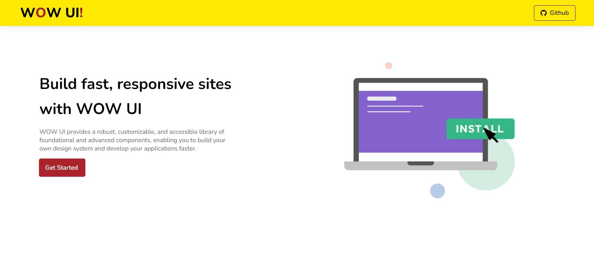
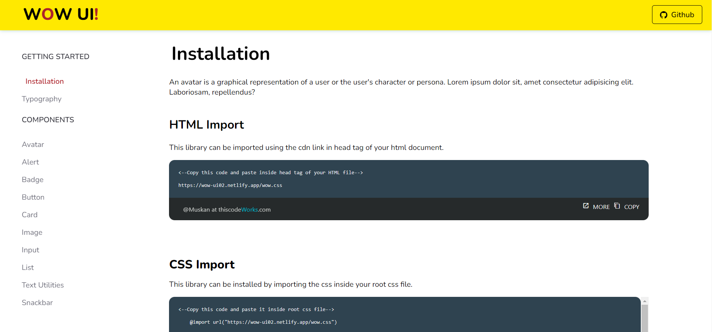

## WOW UI

A component Library which allows you to use and build apps faster by using a reusable components.

You can use this library by importing the cdn link in head tag of your html document.

`https://wow-ui02.netlify.app/wow.css`

# DEMO VIDEO

https://user-images.githubusercontent.com/76219453/155004438-f0e7c1c6-54bb-45c0-99b8-f3c31aecd460.mp4

